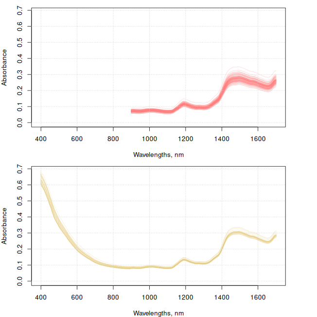
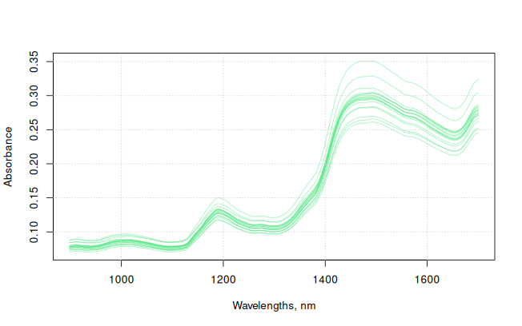
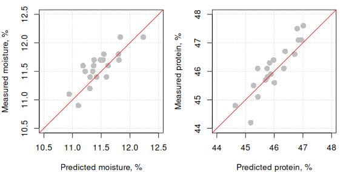

# ProxiMate: Building applications

## 1 Introduction

A Proximate application comprises the following files:

- Calibration data file (.tsv)

- Local data file (.tsv)

- Project files (.prj)

- Calibration model files (.cal)

- Application file (.nax)

- Report files (.rtf)

- Application metadata file (.nad)

A detailed description of the above files and the structure of the
application files can be found in the vignette [Structure of the
application
files](https://buchi-labortechnik-ag.github.io/proximetricsR/articles/af-proximate-structure-of-the-applications.md)

## 2 Build an application

Building an application file requires a series of steps that span from
importing the calibration data file(s) to writing down the files
containing the data of the predictive models for the response variables.
In the following subsections all these steps will be explained.

First of all, the `proximetricsR` and the `prospectr` libraries must be
installed and loaded.

``` r

library("prospectr")
library("proximetricsR")
```

### 2.1 Read the calibration data and prepare it

Here we use a two DEMO files containing spectral data of soybean meal
samples measured with two different BUCHI ProxiMate devices (up-view
mode). These datasets are available at a public repository of BUCHI demo
data.

``` r

# data location
data_loc <- "https://raw.githubusercontent.com/buchi-labortechnik-ag/demo_data/main/data/"

# location of the tsv file containing the spectral data (of soybean meal)
my_file_1 <- "SoybeanMeal_file1.tsv"
my_file_2 <- "SoybeanMeal_file2.tsv"

my_file_1 <- paste0(data_loc, my_file_1)
my_file_2 <- paste0(data_loc, my_file_2)

# read the files
mdata_1 <- proximate_read_data(my_file_1)
mdata_2 <- proximate_read_data(my_file_2)


# explore the structure of the objects of the imported data sets
str(mdata_1, vec.len = 0, give.attr = FALSE)
```

    Classes 'proximate_data' and 'data.frame':  90 obs. of  22 variables:
     $ ROW            : num  NULL ...
     $ Check          : chr   ...
     $ Date           : chr   ...
     $ SNR            : chr   ...
     $ ID             : chr   ...
     $ Barcode        : chr   ...
     $ Note           : chr   ...
     $ Result         : chr   ...
     $ Reference      : chr   ...
     $ Protein        : num  NULL ...
     $ Moisture       : num  NULL ...
     $ EtherealE      : num  NULL ...
     $ MineralM       : num  NULL ...
     $ Soluble_protein: num  NULL ...
     $ Fiber          : num  NULL ...
     $ Urea_activity  : num  NULL ...
     $ Begin          : chr   ...
     $ End            : chr   ...
     $ Recipe         : chr   ...
     $ Composition    : chr   ...
     $ Images         : chr   ...
     $ spc            : num [1:90, 1:249] NULL ...

``` r

str(mdata_2, vec.len = 0, give.attr = FALSE)
```

    Classes 'proximate_data' and 'data.frame':  29 obs. of  21 variables:
     $ ROW        : num  NULL ...
     $ Check      : chr   ...
     $ Date       : chr   ...
     $ SNR        : chr   ...
     $ ID         : chr   ...
     $ Barcode    : chr   ...
     $ Note       : chr   ...
     $ Result     : chr   ...
     $ Reference  : chr   ...
     $ EtherealE  : num  NULL ...
     $ Moisture   : num  NULL ...
     $ Protein    : num  NULL ...
     $ Solubility : num  NULL ...
     $ Fiber      : num  NULL ...
     $ MineralM   : num  NULL ...
     $ Begin      : chr   ...
     $ End        : chr   ...
     $ Recipe     : chr   ...
     $ Composition: chr   ...
     $ Images     : chr   ...
     $ spc        : num [1:29, 1:501] NULL ...

The spectral data is stored as a matrix inside the data object. It can
be accessed by:

``` r

mdata_1$spc
mdata_2$spc
```

The wavelengths of the spectral data can be obtained from the column
names of the spectral matrix as follows:

``` r

original_wavs_1 <- as.numeric(colnames(mdata_1$spc))

original_wavs_2 <- as.numeric(colnames(mdata_2$spc))
```

The spectra loaded can be plotted using the
[`plot()`](https://rdrr.io/r/graphics/plot.default.html) function:

``` r

old_par <- par(no.readonly = TRUE)
par(mfrow = c(2, 1), mar = c(4, 4, 1, 4))

y_max <- max(c(max(mdata_1$spc), max(mdata_2$spc)))

matplot(
  x = original_wavs_1, 
  y = t(mdata_1$spc), 
  xlab = "Wavelengths, nm",
  ylab = "Absorbance", 
  xlim = c(400, 1700), 
  ylim = c(0, y_max),
  type = "l", 
  lty = 1, 
  col = rgb(1, 0.5, 0.5, 0.3)
)
grid()

matplot(
  x = original_wavs_2, 
  y = t(mdata_2$spc), 
  xlab = "Wavelengths, nm",
  ylab = "Absorbance", 
  xlim = c(400, 1700), 
  ylim = c(0, y_max),
  type = "l", 
  lty = 1, 
  col = rgb(0.9, 0.8, 0.5, 0.3)
)
grid()
```



Spectra loaded. Left: datastet 1; Right: Dataset 2

### 2.2 Merge multiple datasets

The two previous vectors (`original_wavs_1` and `original_wavs_2`) are
different as the wavelength positions of the two datasets are different
which prevents direct merging of their spectral data. To solve this
problem, the function
[`proximate_merge()`](https://buchi-labortechnik-ag.github.io/proximetricsR/reference/proximate_merge.md)
can be used:

``` r

mdata <- proximate_merge(list(mdata_1, mdata_2))
```

    Warning in proximate_merge(list(mdata_1, mdata_2)): The set of properties seems
    different across elements

The spectra in the resulting `mdata` object uses the wavelengths of the
first dataset in the list of datasets as the reference wavelengths on
which the spectral data of the remaining datasets will be resampled to.
In this case, the
[`proximate_merge()`](https://buchi-labortechnik-ag.github.io/proximetricsR/reference/proximate_merge.md)
function resampled both, `mdata_2$spc` and `mdata_3$spc` to the
wavelengths of `mdata_1$spc`.

### 2.3 Resample to constant resolution

One of the constrains to work with the the `proximetricsR` package is
that the spectra must be at a constant resolution. The spectra in this
example does not have a constant resolution, however, we can compute the
spectral values at a given set of equally spaced wavelengths (within the
same spectral range of the original set of wavelengths).

``` r

# define the vector of new wavelengths (with constant resolution)
# (replace the psc matrix with the new resampled maxtrix)
# for working with proximetricsR we need to have our spectra in a spc matrix inside 
# the data matrix
mdata$spc <- process(mdata$spc, prep_resample(c(900, 1700, 2)), device = "proximate")
```

The final wavelengths are then:

``` r

final_wavs <- as.numeric(colnames(mdata$spc))
```

``` r

par(old_par)
matplot(
  x = final_wavs, 
  y = t(mdata$spc), 
  xlab = "Wavelengths, nm",
  ylab = "Absorbance", 
  type = "l", 
  lty = 1, 
  col = rgb(0.5, 0.5, 0.5, 0.3)
)
grid()
```


Merged spectra.

### 2.4 Activate/deactivate rows for modeling

In case one or more rows need to be deactivated for modeling, the values
of the `Check` column at these row indices need to be set to
\``"False"`. Note that the deactivated rows are not removed from the
dataset. For instance, if the rows `5`, `10` and `50` need to be
deactivated as follows:

``` r

# a vector with the row indices of the samples to be deactivated
deact <- c(5, 10, 50)
# deactivate
mdata$Check[deact] <- "False"
```

For this example, all the samples/rows in the final dataset will be used
for modeling. For that, it is necessary that all the values in the
`Check` column need to be set to `"True"`.

``` r

mdata$Check <- "True"
```

### 2.5 Get the names of the response variables

A trick to get the names of all the response variables in the data

``` r

# this gets the names of all the variables in the data
names(mdata)

# this returns the column names of all responses
y_names <- extract_property_names(mdata)

# the indices of all the response variables
ys_indices <- which(colnames(mdata) %in% y_names)

# samples with reference values
colSums(!is.na(mdata[, y_names]))
```

From the 8 properties, the examples that will follow will only take into
account 2 of them (the first two): Protein and Moisture.

``` r

#get the names of the response variables
y_names <- y_names[1:2]
```

### 2.6 Calibrating models using `calibrate_models()`

The
[`calibrate_models()`](https://buchi-labortechnik-ag.github.io/proximetricsR/reference/calibrate_models.md)
allows users to automatically build multiple calibration models with the
optimization of the pre-processing methods. This function uses
internally another function named
[`calibrate()`](https://buchi-labortechnik-ag.github.io/proximetricsR/reference/calibrate.md)
(type
[`?calibrate`](https://buchi-labortechnik-ag.github.io/proximetricsR/reference/calibrate.md)
in your R console) for calibrating individual models. The arguments of
[`calibrate_models()`](https://buchi-labortechnik-ag.github.io/proximetricsR/reference/calibrate_models.md)
resemble those of
[`calibrate()`](https://buchi-labortechnik-ag.github.io/proximetricsR/reference/calibrate.md).

Apart from the input calibration data, the
[`calibrate_models()`](https://buchi-labortechnik-ag.github.io/proximetricsR/reference/calibrate_models.md)
function has other 5 main arguments:

- `formulas`: specifies the target formulas of the target models that
  need to be built.

- `metadata_list`: it provides the specifications for the metadata of
  each model in formulas (e.g. the units of the properties).

- `preprocess_recipes`: specifies the sequences of preprocessing methods
  (preprocessing recipes) to be tested.

- `method`: indicates the type of regression method to use along with
  its parameters (e.g. pls or xls).

- `control`: indicates how some aspects of the calibration process must
  be conducted (e.g. cross-validation and outlier detection, etc).

#### 2.6.1 `formulas`: defining what is to be modeled

Here the predictive functions to be calibrated are defined (e.g. protein
as function of spectra) by using the generic way of writing function
formulas in R. To do so, the name of the response variable is given
first, followed by the tilde operator (`~`) and then followed by the
name of the matrix of spectral predictors. The names of the response
variables need to match their names in the respective columns. As the
spectral variables are stored under a matrix in the dataset (typically
named `spc`), the user can directly put the name of the matrix instead
of writing the names of the wavelengths. For example:

``` r

f_simple <- Protein ~ spc

# or 

f_long <- as.formula(paste0("Protein ~ ", paste0(final_wavs, collapse = " + ")))
```

In the previous example, both `f_simple` and `f_long` are equivalent.

In `proximetricsR`, the user can also evaluate multiple functions (for
different response variables) at once. For that it is necessary to
create a list of functions:

``` r

app_formulas <- list(Moisture ~ spc, Protein ~ spc)
```

Alternatively, if we already have the property names, we can do the
following to easily build the model formulas:

``` r

app_formulas <- lapply(paste0(y_names, " ~ spc"), FUN = formula)
app_formulas
```

#### 2.6.2 `metadata_list`: specify the property metadata

Apart from defining the formulas, the user can also indicate some
metadata for each model formula (e.g. the units and the decimal places
to be shown by the sensor when displaying a predicted value). In this
exercise, this is done via:

``` r

# Define the metadata of each model (in the same order they are in app_formulas)
models_metadata <- list(
  # for the first property 
  add_model_metadata(decimal_places = 2, unit = "%"),
  # for the second property
  add_model_metadata(decimal_places = 2, unit = "%") 
)
```

Note that the metadata of each model must be specified in the same order
of response variables as in `app_formulas`.

#### 2.6.3 `preprocess_recipes`: create pre-processing recipes

One of the advantages of using this package is that it uses the concept
of pre-processing recipe. A such recipe is basically the instructions on
how the different pre-processing steps must be executed and what
parameters must be used in each step. The recipe must be built/ordered
in the same sequence the pre-processing steps must be applied. The
following lines of code provide an example on how a recipe is built:

``` r

# here a recipe with the following pre-processing steps is created:
# - spline/resampling: with spectral range between 900 and 1700 in steps of 4
# - StandardNormalVariate
# - First derivative: with a gap parameter of 5 and a smoothing factor of 9
my_precipe_1 <- preprocess_recipe(
  prep_resample(c(900, 1700, 4)),
  prep_snv(),
  prep_derivative(m = 1, w = 5, p = 9, algorithm = "nwp"), 
  device = "proximate"
)

my_precipe_1$preprocessing_order
```

    [1] "resample > snv > derivative (1st)"

Similarly, other recipes can be configured:

``` r

# here a recipe with the following pre-processing steps is created:
# - spline/resampling: with spectral range between 900 and 1700 in steps of 5
# - StandardNormalVariate
# - First derivative: with a gap parameter of 7 and a smoothing factor of 11
my_precipe_2 <- preprocess_recipe(
  prep_resample(c(900, 1700, 4)), 
  prep_snv(),
  prep_derivative(m = 2, w = 7, p = 11, algorithm = "nwp"),
  device = "proximate"
)

my_precipe_2$preprocessing_order
```

    [1] "resample > snv > derivative (2nd)"

``` r

# here a recipe with the following pre-processing steps is created:
# - spline/resampling: with spectral range between 900 and 1700 in steps of 4
# - StandardNormalVariate
# - Second derivative: with a gap parameter of 9 and a smoothing factor of 13
my_precipe_3 <- preprocess_recipe(
  prep_resample(c(900, 1700, 4)), 
  prep_snv(),
  prep_derivative(m = 2, w = 9, p = 13, algorithm = "nwp"),
  device = "proximate"
)

my_precipe_3$preprocessing_order
```

    [1] "resample > snv > derivative (2nd)"

``` r

# here a recipe with the following pre-processing steps is created:
# - spline/resampling: with spectral range between 900 and 1700 in steps of 8
# - StandardNormalVariate
# - Second derivative: with a gap parameter of 5 and a smoothing factor of 5
my_precipe_4 <- preprocess_recipe(
  prep_resample(c(900, 1700, 5)), 
  prep_snv(),
  prep_derivative(m = 2, w = 5, p = 5, algorithm = "nwp"),
  device = "proximate"
)

my_precipe_4$preprocessing_order
```

    [1] "resample > snv > derivative (2nd)"

When calibrating spectral models, usually different pre-processing
recipes are tested. The best recipe is chosen based (at least partially)
on the predictive performance. To make the testing procedure simple,
`proximetricsR` allows to test multiple recipes at once. For this, it is
necessary to group the recipes into a list, as follows:

``` r

my_precipes <- list(my_precipe_1, my_precipe_2, my_precipe_3, my_precipe_4)
```

The `my_precipes` list will be later use for modeling.

#### 2.6.4 `method`: how to fit the spectral models

We need to define what regression method is to be used for the
calibration of the model(s). This can be done as follows:

``` r

# here we use the modified pls regression method (equivalent to the one 
# implemented in NIRWise PLUS)
# We use a maximum 11 components
my_pls_method <- fit_plsr(ncomp = 11, type = "nwp")
my_pls_method
```

    Fitting method: fit_plsr
      ncomp: 11
      type : nwp 

In addition to the
[`fit_plsr()`](https://buchi-labortechnik-ag.github.io/proximetricsR/reference/fit_constructors.md),
the
[`fit_xlsr()`](https://buchi-labortechnik-ag.github.io/proximetricsR/reference/fit_constructors.md)
is also available (see the vignette ***Mathematical overview of
regression algorithms*** for details on both methods).

``` r

# here we use the modified pls regression method (equivalent to the one 
# implemented in NIRWise PLUS)
# We use a maximum 11 components
my_xls_method <- fit_xlsr(ncomp = 11)
my_xls_method
```

    Fitting method: fit_xlsr
      ncomp: 11
      type : nwp
      min_w: 3
      max_w: 15 

#### 2.6.5 `control`: Setting up the calibration parameters

To build calibration models for each response variable we need to define
some generic aspects that control the way in which calibrations are
build (e.g. how validation is to be conducted, how to handle outliers,
etc). To define such overall aspects, the
[`calibration_control()`](https://buchi-labortechnik-ag.github.io/proximetricsR/reference/calibration_control.md)
function can be used. The following code exemplifies how to use that
function to define the cross-validation type and the outlier detection:

``` r

# Control some aspects of how the calibration is built and optimized
# We use k-fold cross-validation with selection of folds based on the order of 
# the samples in the data table ("sequential")
# We also specify the number of times a model must be re-fitted after outlier 
# removal, e.g. 0 means no re-fiting i.e. no outlier removal; 1 means a model is 
# built, then it is used to identify and remove outliers and finally a the final 
# model is refitted; a value of 5 would mean that the model is refitted 4 times 
# for 4 outlier removal iterations. 
my_control <- calibration_control(
  validation_type = "kfold", 
  number = 4,
  folds = "sequential", 
  remove_outliers = 1 # the number of iterations of outlier removal
)
```

Go to the help page of the
[`calibration_control()`](https://buchi-labortechnik-ag.github.io/proximetricsR/reference/calibration_control.md)
to obtain more information on all the calibration aspects that can be
set with this function.

### 2.7 Calibrate the spectral models

Once the pre-processing recipes, the calibration parameters and the
functions to be fitted, the code for calibrating the different models is
rather simple. For example:

``` r

optimized_app <- calibrate_models(
  formulas = app_formulas,
  data = mdata,
  preprocess_recipes = my_precipes,
  methods = list(my_pls_method, my_xls_method),
  control = my_control, 
  metadata_list = models_metadata, 
  save_all = TRUE
)
```

``` r

optimized_app
```

The above object shows you a table with the validation results and the
suggested pre-processing methods per model:

    Grid search results:
               formula recipe min property max property ncomp   rsq  rmse
    1   Protein ~ spc       1         45.1         49.0     4 0.912 0.352
    2 * Protein ~ spc       2         45.1         49.0     4 0.912 0.351
    3   Protein ~ spc       3         45.1         49.0     4 0.910 0.354
    4   Protein ~ spc       4         45.1         49.0     3 0.912 0.351
    5   Moisture ~ spc      1         11.0         13.5     2 0.307 0.394
    6 * Moisture ~ spc      2         11.0         13.5     5 0.420 0.370
    7   Moisture ~ spc      3         11.0         13.5     2 0.307 0.393
    8   Moisture ~ spc      4         11.0         13.4     3 0.316 0.377
      largest_residual outliers    method
    1            0.865        1 XLS (nwp)
    2            0.833        1 PLS (nwp)
    3            0.871        1 PLS (nwp)
    4            0.868        1 PLS (nwp)
    5            0.929        2 XLS (nwp)
    6            1.089        2 PLS (nwp)
    7            0.932        2 XLS (nwp)
    8            0.948        3 PLS (nwp)

    *best model
    ---
    Suggested models:
    Model:  Protein ~ spc
    Spectral preprocessing recipe (device: "proximate"):
     - Step 1: prep_resample
        min_wav: 900; max_wav: 1700; resolution: 4
     - Step 2: prep_snv
     - Step 3: prep_derivative
        m: 2; w: 7; p: 11; algorithm: 'nwp'
    Method:  PLS (nwp)

    Model:  Moisture ~ spc
    Spectral preprocessing recipe (device: "proximate"):
     - Step 1: prep_resample
        min_wav: 900; max_wav: 1700; resolution: 4
     - Step 2: prep_snv
     - Step 3: prep_derivative
        m: 2; w: 7; p: 11; algorithm: 'nwp'
    Method:  PLS (nwp) 

The above object prints a summary of the model optimization results. The
best models are marked with an asterisk (`*`). The preprocessing recipes
are numbered according to their order in the list passed to the
`preprocess_recipes` argument.

#### 2.7.1 Overview of the best models found

These best models are stored in the resulting object under
`...$final_models`:

``` r

optimized_app$final_models
```

``` r

names(optimized_app$final_models)
```

    [1] "Protein ~ spc"  "Moisture ~ spc"

For the above final models, Protein ~ spc and Moisture ~ spc, the best
preprocessing recipes are the ones in `my_precipes` with indices 2 and 2
respectively. This is, for Protein ~ spc:

    Spectral preprocessing recipe (device: "proximate"):
     - Step 1: prep_resample
        min_wav: 900; max_wav: 1700; resolution: 4
     - Step 2: prep_snv
     - Step 3: prep_derivative
        m: 2; w: 7; p: 11; algorithm: 'nwp'

and for Moisture ~ spc:

    Spectral preprocessing recipe (device: "proximate"):
     - Step 1: prep_resample
        min_wav: 900; max_wav: 1700; resolution: 4
     - Step 2: prep_snv
     - Step 3: prep_derivative
        m: 2; w: 7; p: 11; algorithm: 'nwp'

These recipes can be accessed by:

``` r

optimized_app$final_models$`Protein ~ spc`
# and
optimized_app$final_models$`Moisture ~ spc`
```

A comprehensive set of interactive plots describing each model can be
obtained by:

``` r

plot(optimized_app$final_models$`Protein ~ spc`, selection = "all")
# and
plot(optimized_app$final_models$`Moisture ~ spc`, selection = "all")
```

Applying the [`plot()`](https://rdrr.io/r/graphics/plot.default.html)
function on a model produces a HTML file which is immediately loaded and
shown in a browser.

The summary table of the optimization can be accessed by:

``` r

optimized_app$results_grid
```

The `results_grid` table comprises the following fields:

- `formula`: the formulas used to calibrate the spectral models of the
  properties.

- `recipe`: the index of the preprocessing recipe in the list of
  preprocessings passed to the
  [`calibrate_models()`](https://buchi-labortechnik-ag.github.io/proximetricsR/reference/calibrate_models.md)
  function.

- `ncomp`: the optimal number of components found.

- `rsq`: the squared correlation coefficient.

- `rmse`: the rrot mean squared error.

- `largest_residual`: the value of the largest residual found.

- `outliers`: the number of outliers detected and removed.

- `selection`: a logical indicating the final models found for each
  property.

The `TRUE` values in the column `selection` indicate the final models
found. This column can be used to filter the table to show only the
description of the final models:

``` r

optimized_app$results_grid[optimized_app$results_grid$selection, ]
```

             formula recipe min property max property ncomp   rsq  rmse
    2  Protein ~ spc      2         45.1         49.0     4 0.912 0.351
    6 Moisture ~ spc      2         11.0         13.5     5 0.420 0.370
      largest_residual outliers    method selection
    2            0.833        1 PLS (nwp)      TRUE
    6            1.089        2 PLS (nwp)      TRUE

#### 2.7.2 Checking all the models tested

It is possible to use as final models others than the ones
suggested/found by the
[`calibrate_models()`](https://buchi-labortechnik-ag.github.io/proximetricsR/reference/calibrate_models.md)
function. In that case, these models can be extracted from the list of
all models tested, as follows:

``` r

optimized_app$all_models
```

The models in `optimized_app$all_models` are indexed according to the
order given in the `optimized_app$results_grid` table. For example, to
manually extract the models 1 (Protein using preprocessing recipe 1) and
6 (Protein with preprocessing recipe 6):

``` r

my_other_models <- optimized_app$all_models[c(1, 6)]
```

### 2.8 Predicting the properties in unseen samples

In this example we will load another (and independent) file containing
measurements of soybean meal samples:

``` r

my_pred_file <- "SoybeanMeal_file3.tsv"
my_pred_file <- paste0(data_loc, my_pred_file)

pdata <- proximate_read_data(my_pred_file)
original_wavs_pred <- as.numeric(colnames(pdata$spc))
```

``` r

matplot(
  x = original_wavs_pred, 
  y = t(pdata$spc), 
  xlab = "Wavelengths, nm",
  ylab = "Absorbance", 
  type = "l", 
  lty = 1, 
  col = rgb(0.3, 0.9, 0.5, 0.5)
)
grid()
```



Merged spectra.

Predicting for the samples in `pdata` the response values, for which the
models in `optimized_app` were calibrated for, is straightforward. For
that, the new data loaded must contain the predictor variable(s). In
this case, our predictor is `spc` which contains all the necessary
spectral variables used for calibrating the models. We then can use this
data along with the `predict` function and the object containing the
models as follows:

``` r

preds <- predict(optimized_app, newdata = pdata)

# matrix of predictions
preds$predictions

# info on the models used
preds$model_information
```

The `preds`object generated by
[`predict()`](https://rdrr.io/r/stats/predict.html) comprises
`r`length(names(preds))\` components: predictions and model_information.
The first one contains a matrix of predictions while the second one
contains a list with descriptions of the models that were used.

If the reference values are available in the prediction data (as in the
example), we can then compare/validate such predictions. For example:

``` r

old_par <- par(no.readonly = TRUE)
par(mfrow = c(1, 2), mar = c(4, 4, 1, 1))

# Moisture plot
plot(
  x = preds$predictions[, "Moisture"],
  y = pdata$Moisture,
  xlab = "Predicted moisture, %",
  ylab = "Measured moisture, %",
  xlim = c(10.5, 12.5),
  ylim = c(10.5, 12.5),
  pch = 16,
  cex = 1.5,
  col = "grey"
  )
grid()
abline(0, 1, col = "red")

# Protein plot
plot(
  x = preds$predictions[, "Protein"],
  y = pdata$Protein,
  xlab = "Predicted protein, %",
  ylab = "Measured protein, %",
  xlim = c(44, 48),
  ylim = c(44, 48),
  pch = 16,
  cex = 1.5,
  col = "grey"
  )
grid()
abline(0, 1, col = "red")
```



Validation plots for the preditions of the optimal models found

``` r

par(old_par)
```

The squared correlation coefficient and the root mean squared error
(rmse) can be computed by:

``` r

# squared correlations
cor(x = preds$predictions[, "Moisture"],  y = pdata$Moisture)^2
cor(x = preds$predictions[, "Protein"], y = pdata$Protein)^2

# rmses
mean((preds$predictions[, "Moisture"] - pdata$Moisture)^2)^0.5
mean((x = preds$predictions[, "Protein"] - pdata$Protein)^2)^0.5
```

### 2.9 Writting down an application file

An application is basically a collection of calibration models with some
additional parameters (see the ***Structure of the application files***
vignette). This application can be written into a file that can be
imported into the ProxiMate sensor to then be used to predict response
variables from the spectral measurements made with that sensor. The
`proximetricsR` package also offers a function to write down this
application file. For this, the models that the user wants to include in
the application need to be placed together into a `list` object. For
example:

``` r

my_models <- optimized_app$final_models

# add some important metadata to the application/model list
my_models <- add_application_metadata(
  my_models, 
  view = "Up", 
  name = "my_application", 
  description = "created with proximetricsR"
)
```

The order in which the objects are declared in the list will be the same
order in which their corresponding response variables will be shown in
the ProxiMate sensor.

The application for the calibration models inside `my_models` can be
finally be written as follows:

``` r

proximate_write_nax(
  path = getwd(),
  object = my_models
)
```

## 3 Other functionality

### 3.1 Calibrate single models with `calibrate`

``` r

my_p_recipe <- preprocess_recipe(
  prep_resample(c(900, 1700, 2)),
  prep_snv(),
  prep_derivative(m = 1, w = 5, p = 3, algorithm = "nwp"),
  device = "proximate"
)

protein_model <- calibrate(
  Protein ~ spc, 
  data = mdata, 
  preprocess = my_p_recipe, # here we can use only one recipe
  method = fit_xlsr(5, type = "nwp"), 
  control = my_control
)
protein_model

# add the units and the number of decimal places to the model
protein_model <- add_model_metadata(
  protein_model,
  unit = "%", 
  decimal_places = 2
)

plot(protein_model, selection = "all")
```

The fitted model can also be used to make predictions on new data. Just
for demonstration purposes, here we will use the `mdata` data set (the
one used for model building) to show how predictions can be obtain from
the model applied on spectra:

``` r

# add the units and the number of decimal places to the model
my_protein_predictions <- predict(protein_model, newdata = pdata$spc)
my_protein_predictions$model_information
my_protein_predictions$predictions
```

``` r

# create a list with all the models separately calibrated
# (in this case we only have one)
a_model <- list(protein_model)

a_model <- add_application_metadata(
  a_model, 
  view = "Up", 
  name = "a_protein_application", 
  description = "created with proximetricsR"
)

proximate_write_nax(
  path = getwd(),
  object = a_model
)
```

The calibration of a single model can also be useful when there is a
model that we might want to replace in the list of models suggested by
[`calibrate_models()`](https://buchi-labortechnik-ag.github.io/proximetricsR/reference/calibrate_models.md).
For example:

``` r

my_models <- optimized_app$final_models
my_models$`Protein ~ spc` <- protein_model
```

### 3.2 Write model-related files (`tsv`, `cal`, `prj` and `rtf`)

The calibration (.cal), project (.prj) and report (.rtf) files native of
the NIRWise PLUS software can be written down using the
[`proximate_write_model()`](https://buchi-labortechnik-ag.github.io/proximetricsR/reference/proximate_write_model.md)
function. To be able to use such files, it is necessary to have local
access to the data (.tsv) file containing the calibration data used to
fit the models. For example:

``` r

# let's write down the calibration data into a tsv file 
# define a name for the tsv to be written 
tsv_name <- "merged_cal_data.tsv"

# write the tsv
proximate_write_data(
  x = mdata,
  file = tsv_name,
  id = mdata$ID,
  spc = "spc",
  spc_round = 8,
  barcode = "",
  properties = y_names,
  note = "merged_file_1_and_file_2",
  recipe = "SoybeanMeal up-view",
  created = mdata$Date,
  snr = mdata$SNR
)
```

``` r

proximate_write_model(
  object = list(protein_model),
  path = getwd(),
  tsv_paths = tsv_name,
  application_name = "Untitled",
  cal = TRUE,
  prj = TRUE,
  rtf = TRUE
)
```

Note that project files can be opened in NIRWise PLUS. So, if you have
access to that software you could try to open the .prj file written with
the above code.
