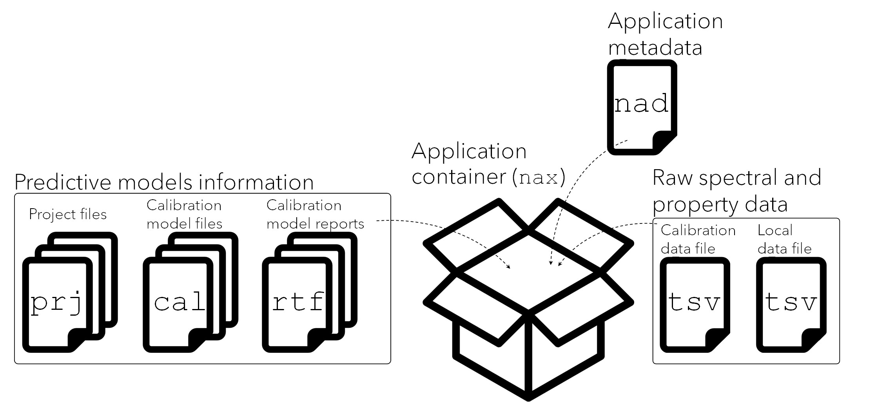

# ProxiMate: Structure of the applications

## 1 Introduction

This package can be used to build and/or update NIR applications that
are ready to be consumed by the [ProxiMate series of NIR
sensors](https://www.buchi.com/en/products/instruments/proximate)
manufactured by BUCHI Labortechnik AG. Once an application is installed
in a ProxiMate device, it can be used to predict the properties of a
given matrix using the spectral models contained in that application.

This package builds upon the standard structure of the ProxiMate
applications, which are conventionally developed with the
compiled-executable software “NIRWise PLUS” offered by BUCHI. Therefore,
the files output by `proximetricsR` follow the same structure of the
ones output by “NIRWise PLUS”. No changes or improvements on these
output files have been conducted for the development of `proximetricsR`.

## 2 Structure of the ProxiMate predictive applications

ProxiMate applications can be described as a collection of predictive
models that, along with other metadata, are packed into a single file
that can be installed in a ProxiMate sensor. Once an application is
imported, the sensor can be used to predict the properties of samples
the application was built for.

A Proximate application comprises the following files:

- Calibration data file (.tsv): a file containing the main data used to
  build the predictive models.

- Local data file (.tsv): a file where the spectral data (and eventually
  property data) collected by the user is stored.

- Calibration model files (.cal): these files contain a predictive model
  along with the spectral processing methods to be applied before the
  model is used for prediction. A .cal file for every model is present
  in the application.

- Project files (.prj): these files contain information about the model
  parameters and results. For each model in the application, a .prj file
  is present in the application.

- Report files (.rtf): a file containing a summary of the model
  calibration results.

- Application metadata file (.nad): a file containing some parameters of
  the application (e.g. scanning time, standard operating procedure,
  property units, etc).

- Application file (.nax): a single “container” file where all the
  previous files are stored as shown in Figure
  [Figure 1](#fig-filestructure).



Figure 1: Files inside the application file

### 2.1 Calibration data file (.tsv)

This is the main input file which contains the predictor (spectra) and
response (properties) data used to calibrate the models. The data is
stored as a tab separated table. Every row in this table represents a
single spectral measurement of a sample along with its associated data
(e.g.  property values, date, etc.). This table is usually exported
directly from the ProxiMate devices and typically contains columns with
the following fields:

- `ROW`: a numeric which indicates the row number.

- `Check`: a logical value `true` or `false`. Note that these values are
  written in low-case letters and do not represent `R` logical values,
  therefore they are interpreted in `R` as characters. However, they are
  interpreted by ProxiMate systems as logical.

- `Date`: the date in which the measurement was collected
  (day/month/year hour:min:sec, e.g. `17/12/2020 10:06:25`)

- `SNR`: a character string with the serial number(s) of the detector(s)
  in the NIR sensor device. An additional serial number is provided if
  measurements were done with a sensor that includes a detector for
  measuring spectra in the visible range of the electromagnetic spectrum
  (e.g. `918FG118;1502091`).

- `ID`: a character string indicating the sample name.

- `Barcode`: a character string with metadata of the sample. It is a
  placeholder for data which is typically read from barcode scanners.

- `Note`: a character string with metadata of the sample.

- `Result`: a string containing numbers separated by a semicolon. Each
  number indicates the predicted value of a property. This information
  is shown if the samples in the file were collected by the ProxiMate
  sensor using a predictive application. This column is not used by
  `proximetricsR`.

- `Reference`: a string containing numbers separated by a semicolon.
  Each number indicates the reference value of a property. This
  information is shown if the user of the ProxiMate sensor input these
  values in the instrument. This column is not used by `proximetricsR`.

- Properties: multiple columns that contain the reference values of the
  corresponding property. For each property, there is a single column
  with the property name as its header. The name of each property is
  assigned by the user.

- `Begin`: a string indicating the time at which the measurement started
  (hour:min:sec, e.g. `10:06:25`).

- `End`: a string indicating the time at which the measurement ended
  (hour:min:sec, e.g. `10:06:40`).

- `Recipe`: a string indicating the matrix or the application name.

- `Composition`: an empty column (not used).

- `Images`: an empty column (not used).

- Spectral data: the spectral data in ProxiMate devices is collected by
  using diode-array detectors (see [Workman and Burns
  2001](#ref-workman2001commercial) for a description of this type of
  technology). These detectors record the spectral information at
  different photodiode pixels. The .tsv file contains absorbance data
  collected at each pixel by the detectors. Each pixel represents an
  specific wavelength (in nm units). To obtain the wavelength
  information for each pixel a polynomial function needs to be applied
  to each pixel number/index. The following columns contain all the
  necessary spectral information:

  - `#X1`: index of the first pixel(s). If there are two detectors
    (visible and NIR), this field contains two numbers: the index of the
    first pixel for the visible detector and a second number indicating
    the index of the first pixel of the NIR detector. For example, a
    value `823, 4` indicates that the index of the first pixel for the
    visible detector is `823` and the index of the first pixel for the
    NIR detector is `4`. The NIR pixel indices are zero-based, therefore
    the correct one-based counts is`5`.

  - `#X2`: index of the last pixel(s). If there are two detectors
    (visible and NIR), this filed contains two numbers: the index of the
    last pixel for the visible detector and a second number indicating
    the last of the first pixel of the NIR detector. For example, a
    value `1074, 272` indicates that the index of the last pixel for the
    visible detector is `1074` and the index of the last pixel for the
    NIR detector is `272.` The NIR pixel indices are zero-based,
    therefore the corrected one-based counts is `273`.

  - `#X3`: a string with the set(s) of polynomial coefficients. If there
    are two detectors (visible and NIR), this field will contain two
    sets of coefficients, otherwise it contains only one set
    corresponding to the coefficients of the NIR detector. The
    coefficients are separated by semicolon, while the set of
    coefficients (if applies) are separated by a comma. The polynomial
    order is inferred/derived from the number of values in the set of
    coefficients and they are sequentially arranged from the largest to
    the lowest degree. For example, the value
    `0;0;-7.586146E-05;2.12726;-1301.079, 2.04E-10;-1.28E-07;2.80E-05;-4.76E-03;3.89;880.06`
    represents the coefficients of a fourth degree polynomial for the
    visible part (before the comma) and a fifth degree polynomial for
    the near-infrared part (after the comma). For example, the first
    value in the wavelengths for both NIR and VIS, using the example
    values for `#X1` to `#X3` as above, can be obtained as follows:

``` r

first_pixel_nir <- 4
first_pixel_count_nir <- first_pixel_nir + 1
first_wavelength_nir <- 2.04E-10 * first_pixel_count_nir^5 + 
  -1.28E-07 * first_pixel_count_nir^4 + 
   2.80E-05 * first_pixel_count_nir^3 +
  -4.76E-03 * first_pixel_count_nir^2 + 
   3.89     * first_pixel_count_nir   + 
   880.06
first_wavelength_nir
```

    [1] 899.3944

``` r

first_pixel_count_vis <- 823
first_wavelength_vis <- 0.0 * first_pixel_count_vis^4 + 
   0.0          * first_pixel_count_vis^3 +
  -7.586146E-05 * first_pixel_count_vis^2 + 
   2.12726      * first_pixel_count_vis   + 
  -1301.079
first_wavelength_vis
```

    [1] 398.2728

A sequence of numbers can be used to obtain all the wavelengths at once.
This sequence must start with the index of the first pixel and end with
the index of the last pixel. Continuing the previous example, we can
obtain all wavelengths at once as follows:

``` r

pixel_sequence_nir <- 4:272
pixel_sequence_count_nir <- pixel_sequence_nir + 1

wavelengths_nir <- 2.04E-10 * pixel_sequence_count_nir^5 + 
  -1.28E-07 * pixel_sequence_count_nir^4 +
   2.80E-05 * pixel_sequence_count_nir^3 +
  -4.76E-03 * pixel_sequence_count_nir^2 + 
   3.89     * pixel_sequence_count_nir   + 
  880.06

wavelengths_nir[1:5]
```

    [1] 899.3944 903.2345 907.0661 910.8892 914.7040

``` r

wavelengths_nir[(length(wavelengths_nir) - 5):length(wavelengths_nir)]
```

    [1] 1741.389 1744.169 1746.953 1749.742 1752.534 1755.332

``` r

pixel_sequence_vis <- 823:1074
wavelengths_vis <- 0.0 * pixel_sequence_vis^4 + 
   0.0          * pixel_sequence_vis^3 +
  -7.586146E-05 * pixel_sequence_vis^2 + 
   2.12726      * pixel_sequence_vis   + 
  -1301.079

wavelengths_vis[1:5]
```

    [1] 398.2728 400.2751 402.2773 404.2793 406.2812

``` r

wavelengths_vis[(length(wavelengths_vis) - 5):length(wavelengths_vis)]
```

    [1] 886.2704 888.2354 890.2003 892.1649 894.1295 896.0939

- 

  - Spectral data: the spectral data of each pixel are stored in the
    columns named with a hash character followed by a number
    (e.g. `#3`). Note that these numbers do not represent the pixel
    index.

### 2.2 Local data file (.tsv)

This file has the same structure as the “Calibration data file”. The
only difference is that this local file is used to store spectra
measured by the user of the application. A spectrum is written to this
file only if one or more of its reference (response) values are manually
input by the user directly in the instrument.

### 2.3 Calibration model files (.cal)

These files store both the instructions for spectral pre-processing and
the parameters of calibrated models. Each file contains one single
model, i.e. if an application contains *n* predictive models, then there
will be *n* cal files in the application. These files are used by the
the sensor instruments to conduct the required predictions of the
response variables in the application.

### 2.4 Project files (.prj)

These files store all the final results obtained when a calibration
model is built. This file can be imported into the NIRWise PLUS software
to visualize the calibration model results and the used settings. Note
that the files are not used to generate predictions as their purpose is
limited to the visualization and review of the models. The project file
may contain the pre-pocessed spectra, the data matrices generated during
the calibration process, the information about the type of model
validation, the outlier detection method used, the response residuals,
etc.

### 2.5 Report files (.rtf)

These files are in rich text format, each containing a report on the
results of the calibration of a single response variable in the
application. This report includes information such as the original tsv
file used for the calibrations, the number of observations used and
their indices in the tsv table, the standard error of the calibration
(SEC), the coefficient of determination (R^2), etc.

### 2.6 Application metadata file (.nad)

This file contains application metadata such as the application name
(the name that will be shown when it is imported into a sensor), the
sample measurement geometry, measurement time, the creation date, the
standard operating procedure, additive (offset) and multiplicative
(slope) adjustments to the predicted response values, outlier detection
parameters, etc.

### 2.7 Application file (.nax)

This file acts as a container for all the files described above. It is
in fact a [ZIP file](https://en.wikipedia.org/wiki/ZIP_(file_format))
used to pack and compress the application files. The file and folder
structure inside a container with *n* predictive models can be described
as follows:

    <appliation>.nax
    │   <application>.nad
    │
    └───Calibrations
       │   <application>.<property_1>.cal
       │   <application>.<property_1>.prj
       │   <application>.<property_1>.rtf
       │   ...
       │   <application>.<property_n>.cal
       │   <application>.<property_n>.prj
       │   <application>.<property_n>.rtf
       │
       └───Data
       │    │   <Calibration data file>.tsv
       │
       └───Local
            │   <Local data file>.tsv

## References

Workman, JJ, and Donald A Burns. 2001. “Commercial NIR Instrumentation.”
*PRACTICAL SPECTROSCOPY SERIES* 27: 53–70.
