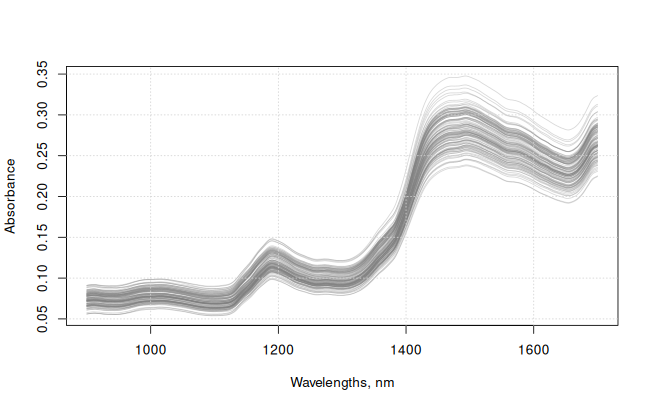

# ProxiMate: Read and recalibrate applications

## 1 Summary

This vignette presents a set of experimental functions aimed at
facilitating the read, exploration and re-calibration of ProxiMate
applications.

``` r

library("prospectr")
library("proximetricsR")
```

### 1.1 Calibrate an application and write a nax

Here we use a two DEMO files containing spectral data of soybean meal
samples measured with two different BUCHI ProxiMate devices (up-view
mode). These datasets are available at a public repository of BUCHI demo
data.

``` r

# In practice, set this to the directory containing your data files, e.g.:
# my_working_dir <- "C:/Users/YourName/Downloads"
# my_working_dir <- "~/Downloads"
my_working_dir <- "path/to/your/data"
setwd(my_working_dir)
```

``` r

# Data location
data_loc <- "https://raw.githubusercontent.com/buchi-labortechnik-ag/demo_data/main/data/"

# Location of the TSV files containing the spectral data of soybean meal
my_file_1 <- "SoybeanMeal_file1.tsv"
my_file_2 <- "SoybeanMeal_file2.tsv"

my_file_1 <- paste0(data_loc, my_file_1)
my_file_2 <- paste0(data_loc, my_file_2)

# Read the files
mdata_1 <- proximate_read_data(my_file_1)
mdata_2 <- proximate_read_data(my_file_2)

mdata <- proximate_merge(list(mdata_1, mdata_2))
```

    Warning in proximate_merge(list(mdata_1, mdata_2)): The set of properties seems
    different across elements

``` r

# Define the vector of new wavelengths with constant resolution.
# Replace the spc matrix with the new resampled matrix.
# For working with proximetricsR, spectra must be stored in an spc matrix
# inside the data matrix.
mdata$spc <- process(mdata$spc, prep_resample(c(900, 1700, 2)))

final_wavs <- as.numeric(colnames(mdata$spc))
```

``` r

matplot(
  x = final_wavs,
  y = t(mdata$spc),
  xlab = "Wavelengths, nm",
  ylab = "Absorbance",
  type = "l",
  lty = 1,
  col = rgb(0.5, 0.5, 0.5, 0.3)
)
grid()
```



Merged spectra.

``` r

# This gets the names of all variables in the data
names(mdata)
```

     [1] "ROW"             "Check"           "Date"            "SRN"
     [5] "SNR"             "ID"              "Barcode"         "Note"
     [9] "Result"          "Reference"       "Protein"         "Moisture"
    [13] "EtherealE"       "MineralM"        "Soluble_protein" "Fiber"
    [17] "Urea_activity"   "Solubility"      "Begin"           "End"
    [21] "Recipe"          "Composition"     "Images"          "spc"            

``` r

# This returns the column names of all responses
y_names <- extract_property_names(mdata)

# The indices of all response variables
ys_indices <- which(colnames(mdata) %in% y_names)

# Samples with reference values
colSums(!is.na(mdata[, y_names]))
```

            Protein        Moisture       EtherealE        MineralM Soluble_protein
                119             119             118              63              90
              Fiber   Urea_activity      Solubility
                 67              39              29 

From the 8 properties, the examples that will follow will only take into
account 2 of them (the first two): Protein and Moisture.

``` r

# Get the names of the response variables
y_names <- y_names[1:2]
```

``` r

# Define the necessary objects for creating an application
app_formulas <- lapply(paste0(y_names, " ~ spc"), FUN = formula)
app_formulas

# Define the metadata of each model, in the same order as app_formulas
models_metadata <- list(
  # For the first property
  add_model_metadata(decimal_places = 2, unit = "%"),
  # For the second property
  add_model_metadata(decimal_places = 2, unit = "%")
)

# Recipe with:
# - spline/resampling: spectral range between 900 and 1700 in steps of 4
# - standard normal variate
# - first derivative: gap parameter 5 and smoothing factor 9
my_precipe_1 <- preprocess_recipe(
  prep_resample(c(900, 1700, 4)),
  prep_snv(),
  prep_derivative(m = 1, w = 5, p = 9, algorithm = "nwp"), 
  device = "proximate"
)

my_precipe_1$preprocessing_order

# Recipe with:
# - spline/resampling: spectral range between 900 and 1700 in steps of 4
# - standard normal variate
# - second derivative: gap parameter 7 and smoothing factor 11
my_precipe_2 <- preprocess_recipe(
  prep_resample(c(900, 1700, 4)),
  prep_snv(),
  prep_derivative(m = 2, w = 7, p = 11, algorithm = "nwp"), 
  device = "proximate"
)

my_precipe_2$preprocessing_order

# Recipe with:
# - spline/resampling: spectral range between 900 and 1700 in steps of 4
# - standard normal variate
# - second derivative: gap parameter 9 and smoothing factor 13
my_precipe_3 <- preprocess_recipe(
  prep_resample(c(900, 1700, 4)),
  prep_snv(),
  prep_derivative(m = 2, w = 9, p = 13, algorithm = "nwp"), 
  device = "proximate"
)

my_precipe_3$preprocessing_order

my_precipes <- list(my_precipe_1, my_precipe_2, my_precipe_3)
```

``` r

# Use the modified PLS regression method, equivalent to the one
# implemented in NIRWise PLUS.
# We use a maximum of 11 components.
my_pls_method <- fit_plsr(ncomp = 11, type = "nwp")
my_pls_method
```

    Fitting method: fit_plsr
      ncomp: 11
      type : nwp 

``` r

# Control some aspects of how the calibration is built and optimized
# We use k-fold cross-validation with selection of folds based on the order of 
# the samples in the data table ("sequential")
# We also specify the number of times a model must be re-fitted after outlier 
# removal, e.g. 0 means no re-fiting i.e. no outlier removal; 1 means a model is 
# built, then it is used to identify and remove outliers and finally a the final 
# model is refitted; a value of 5 would mean that the model is refitted 4 times 
# for 4 outlier removal iterations. 
my_control <- calibration_control(
  validation_type = "kfold", 
  number = 4,
  folds = "sequential", 
  remove_outliers = 1 # the number of iterations of outlier removal
)
```

Finally, calibrate the models:

``` r

optimized_app <- calibrate_models(
  formulas = app_formulas,
  data = mdata,
  preprocess_recipes = my_precipes,
  methods = list(my_pls_method),
  control = my_control, 
  metadata_list = models_metadata, 
  save_all = TRUE
)
```

    [31m--- Finding model for Protein ~ spc ----[39m
    [31m +[39m testing preprocessing recipe index 1
    [31m +[39m testing preprocessing recipe index 2
    [31m +[39m testing preprocessing recipe index 3
    [31m--- Finding model for Moisture ~ spc ----[39m
    [31m +[39m testing preprocessing recipe index 1
    [31m +[39m testing preprocessing recipe index 2
    [31m +[39m testing preprocessing recipe index 3

``` r

optimized_app
```

    Grid search results:
               formula recipe min property max property ncomp   rsq  rmse
    1   Protein ~ spc       1         45.1         49.0     4 0.898 0.377
    2 * Protein ~ spc       2         45.1         49.0     4 0.912 0.351
    3   Protein ~ spc       3         45.1         49.0     4 0.910 0.354
    4   Moisture ~ spc      1         11.0         13.5     2 0.293 0.398
    5 * Moisture ~ spc      2         11.0         13.5     5 0.420 0.370
    6   Moisture ~ spc      3         11.0         13.5     2 0.307 0.394
      largest_residual outliers    method
    1            1.034        0 PLS (nwp)
    2            0.833        1 PLS (nwp)
    3            0.871        1 PLS (nwp)
    4            0.917        2 PLS (nwp)
    5            1.089        2 PLS (nwp)
    6            0.927        2 PLS (nwp)

    *best model
    ---
    Suggested models:
    Model:  Protein ~ spc
    Spectral preprocessing recipe (device: "proximate"):
     - Step 1: prep_resample
        min_wav: 900; max_wav: 1700; resolution: 4
     - Step 2: prep_snv
     - Step 3: prep_derivative
        m: 2; w: 7; p: 11; algorithm: 'nwp'
    Method:  PLS (nwp)

    Model:  Moisture ~ spc
    Spectral preprocessing recipe (device: "proximate"):
     - Step 1: prep_resample
        min_wav: 900; max_wav: 1700; resolution: 4
     - Step 2: prep_snv
     - Step 3: prep_derivative
        m: 2; w: 7; p: 11; algorithm: 'nwp'
    Method:  PLS (nwp) 

The above object shows you a table with the validation results and the
suggested pre-processing methods per model:

    Grid search results:
               formula recipe min property max property ncomp   rsq  rmse
    1   Protein ~ spc       1         45.1         49.0     4 0.898 0.377
    2 * Protein ~ spc       2         45.1         49.0     4 0.912 0.351
    3   Protein ~ spc       3         45.1         49.0     4 0.910 0.354
    4   Moisture ~ spc      1         11.0         13.5     2 0.293 0.398
    5 * Moisture ~ spc      2         11.0         13.5     5 0.420 0.370
    6   Moisture ~ spc      3         11.0         13.5     2 0.307 0.394
      largest_residual outliers    method
    1            1.034        0 PLS (nwp)
    2            0.833        1 PLS (nwp)
    3            0.871        1 PLS (nwp)
    4            0.917        2 PLS (nwp)
    5            1.089        2 PLS (nwp)
    6            0.927        2 PLS (nwp)

    *best model
    ---
    Suggested models:
    Model:  Protein ~ spc
    Spectral preprocessing recipe (device: "proximate"):
     - Step 1: prep_resample
        min_wav: 900; max_wav: 1700; resolution: 4
     - Step 2: prep_snv
     - Step 3: prep_derivative
        m: 2; w: 7; p: 11; algorithm: 'nwp'
    Method:  PLS (nwp)

    Model:  Moisture ~ spc
    Spectral preprocessing recipe (device: "proximate"):
     - Step 1: prep_resample
        min_wav: 900; max_wav: 1700; resolution: 4
     - Step 2: prep_snv
     - Step 3: prep_derivative
        m: 2; w: 7; p: 11; algorithm: 'nwp'
    Method:  PLS (nwp) 

Write the application file:

``` r

my_models <- optimized_app$final_models

# add some important metadata to the application/model list
my_models <- add_application_metadata(
  my_models, 
  view = "Up", 
  name = "my_application", 
  description = "created with proximetricsR"
)

proximate_write_nax(
  path = getwd(),
  object = my_models
)
```

## 2 Read ProxiMate application files (.nax)

Simple:

``` r

my_nax <- proximate_read_nax("my_application.nax")
```

## 3 Recalibrate application

### 3.1 Just re-fit the models

Simple:

``` r

my_recalnax <- proximate_recalibrate_nax(my_nax)
```

    Warning in proximate_recalibrate_nax(my_nax): This is an experiental
    function!😉 Feedback is highly appreciated 🙌

### 3.2 Recalibrate based on new data

``` r

my_pred_file <- "SoybeanMeal_file3.tsv"
my_pred_file <- paste0(data_loc, my_pred_file)

pdata <- proximate_read_data(my_pred_file)

# prepare the data to add to the nax
to_add <- proximate_add2nax(data = pdata)

# re-calibrate based on the new data
my_recalnax2 <- proximate_recalibrate_nax(my_nax, add = to_add)
```

    Warning in proximate_recalibrate_nax(my_nax, add = to_add): This is an
    experiental function!😉 Feedback is highly appreciated 🙌

    Warning in proximate_merge(list(mdata, add$data)): The set of properties seems
    different across elements
